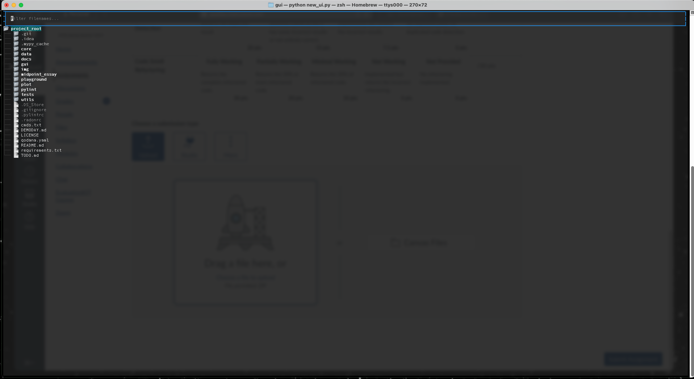
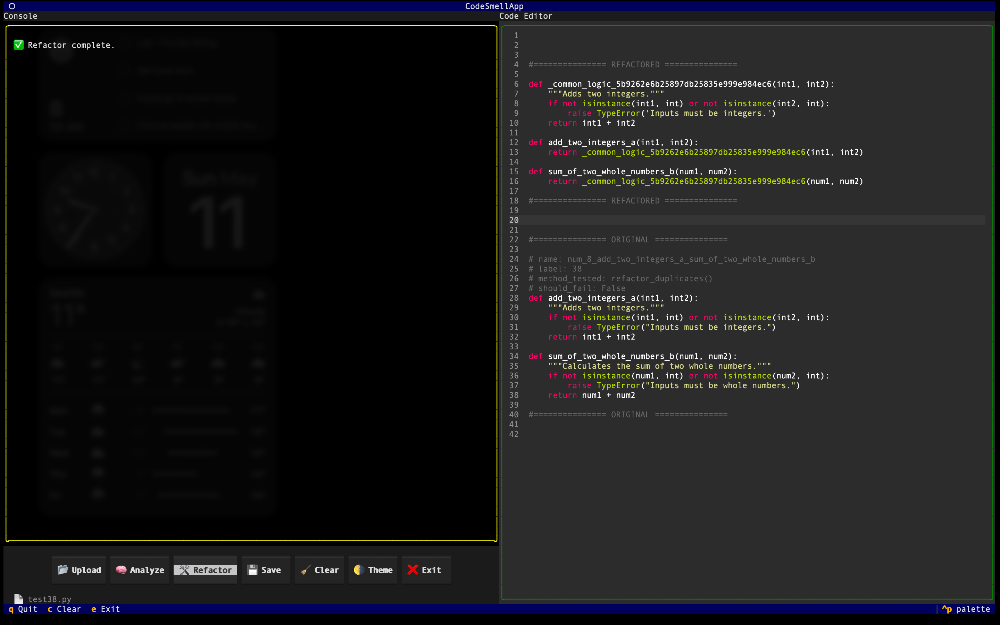
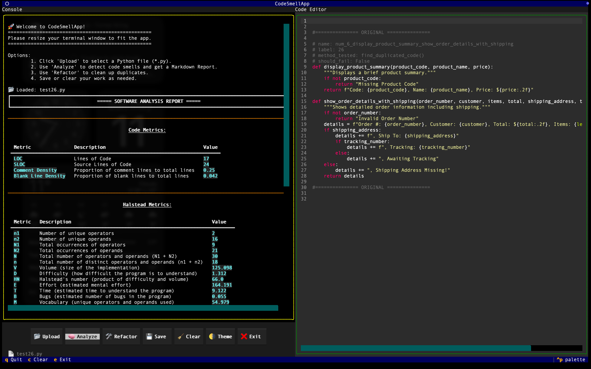

# Code Smell App

> A simple Textual-based GUI for analyzing and refactoring Python code to detect and fix code smells.

## Table of Contents
- [Overview](#overview)
- [Features](#features)
- [Installation](#installation)
- [Usage](#usage)
- [Examples](#examples)
- [Project Structure](#project-structure)
- [Contributing](#contributing)
- [License](#license)
- [Acknowledgments](#acknowledgments)

## Overview
CodeSmellApp is a Python application built for CPSC 4260 - Software Refactoring. It provides a user-friendly interface using the [Textual](https://textual.textualize.io/) library to:
- Upload Python files for analysis.
- Detect code smells and generate Markdown reports.
- Refactor code to eliminate duplicates (Supports Type 1, 2, and 3).
- Save refactored code to new files.

The app is designed for developers and students working on code quality improvement, offering an intuitive way to interact with code analysis and refactoring tools. It solves the problem of manual code smell detection and duplicate code refactoring by automating these processes in a visual environment.

## Features
- ✅ **File Upload**: Select Python files via a directory tree picker.
- ✅ **Code Smell Analysis**: Detects code smells and displays results and metrics as a Markdown report in the console.
- ✅ **Refactoring**: Automatically refactors duplicate code and displays results in the code editor.
- ✅ **Save Functionality**: Saves refactored code to a new file.
- ✅ **Theme Switching**: Toggle between dark and light themes.
- ✅ **Clear and Exit**: Clear the editor/console or exit with confirmation dialogs.
- 🚧 **Grading Mode**: Experimental support for setting project root during grading (in progress).

## Installation
```bash
# Clone the repository (replace with your repo URL)
git clone https://github.com/j-balkovec/CPSC4260
cd gui

# Create a virtual environment (recommended)
python -m venv venv
source venv/bin/activate  # On Windows: venv\Scripts\activate

conda activate vene # If using Anaconda

# Install dependencies
pip install -r requirements.txt
```
**Note**: Ensure **Python 3.8+** is installed. Additional dependencies may be required based on core and utils modules (e.g., pathlib, logging).

## Usage
Run the application:

```bash
python new_ui.py
```

The app launches a Textual-based GUI with the following workflow:

- Click **Upload** to select a .py file.
- Use **Analyze** to detect code smells.
- Use **Refactor** to clean up duplicates.
- Click **Save** to store refactored code or Clear to reset the editor/console.
- Toggle the theme or exit as needed.

## Examples

### Uploading a File
- Click **Upload**, navigate the directory tree, and select a .py file.
- **Output** in the console:
```plaintext
📂 Loaded: example.py
```

The code editor displays the file's contents.

### Analyzing Code Smells
- Click **Analyze** after uploading a file.
- **Output** in the console is a neatly formatted Markdown report
- Errors (e.g., file not found) are logged:
```plaintext
❌ File not found: example.py
```

### Refactoring
- Click **Refactor** to remove duplicates.
- **Output** in the code editor:
```python
# =============== REACTORED ==============
def _common_logic_6a66bdf324c4e92e0313ab42dc5839ef(val1, val2):
    """Computes the product of two values."""
    if not isinstance(val1, (int, float)) or not isinstance(val2, (int, float)):
        raise TypeError('Inputs must be numeric.')
    return val1 * val2

def multiply_two_numbers_a(x, y):
    return _common_logic_6a66bdf324c4e92e0313ab42dc5839ef(x, y)

def compute_product_of_two_values_b(val1, val2):
    return _common_logic_6a66bdf324c4e92e0313ab42dc5839ef(val1, val2)
# =============== REACTORED ==============

# =============== ORIGINAL ===============
def multiply_two_numbers_a(x, y):
    """Multiplies two numbers."""
    if not isinstance(x, (int, float)) or not isinstance(y, (int, float)):
        raise TypeError("Inputs must be numbers.")
    return x * y

def compute_product_of_two_values_b(val1, val2):
    """Computes the product of two values."""
    if not isinstance(val1, (int, float)) or not isinstance(val2, (int, float)):
        raise TypeError("Inputs must be numeric.")
    return val1 * val2
# =============== ORIGINAL ===============    
```
- Console confirms:
```plaintext
✅ Refactor complete.
```

## Project Structure
```bash
.
├── LICENSE
├── README.md
├── TODO.md
├── core
│   ├── __pycache__
│   │   ├── code_metrics.cpython-312.pyc
│   │   ├── code_smells.cpython-312.pyc
│   │   ├── constants.cpython-312.pyc
│   │   ├── duplicated_finder.cpython-312.pyc
│   │   ├── file_info_extractor.cpython-312.pyc
│   │   ├── file_saver.cpython-312.pyc
│   │   ├── halstead.cpython-312.pyc
│   │   ├── method_length.cpython-312.pyc
│   │   ├── param_length.cpython-312.pyc
│   │   ├── refactor.cpython-312.pyc
│   │   └── refactor2.cpython-312.pyc
│   ├── code_metrics.py
│   ├── code_smells.py
│   ├── constants.py
│   ├── duplicated_finder.py
│   ├── file_info_extractor.py
│   ├── file_saver.py
│   ├── halstead.py
│   ├── method_length.py
│   ├── param_length.py
│   └── refactor.py
├── data
│   ├── info
│   ├── json
│   ├── logs
│   ├── output
│   ├── readable
│   ├── refactored
│   └── report
├── docs
│   ├── DOCUMENTATION.md
│   ├── SQ 2025 Individual Project Description.pdf
│   └── duplicated_code_guide.md
├── gui
│   ├── __pycache__
│   │   └── new_ui.cpython-312.pyc
│   ├── new_ui.py
│   ├── terminal_ui.py
│   └── textual_ui.css
├── img
│   ├── file_picker.png
│   ├── refactor.png
│   └── report.png
├── playground
│   └── playground.py
├── requirements.txt
├── tests
│   ├── Makefile
│   ├── README.md
│   ├── __pycache__
│   │   ├── conftest.cpython-312-pytest-8.3.5.pyc
│   │   ├── sys_test.cpython-312-pytest-8.3.5.pyc
│   │   └── unit_tests.cpython-312-pytest-8.3.5.pyc
│   ├── conftest.py
│   ├── out
│   │   └── test_log.log
│   ├── pytest.ini
│   ├── sys_test.py
│   ├── test1.py
│   ├── test10.py
│   ├── test11.py
│   ├── test12.py
│   ├── test13.py
│   ├── test14.py
│   ├── test15.py
│   ├── test16.py
│   ├── test17.py
│   ├── test18.py
│   ├── test19.py
│   ├── test2.py
│   ├── test20.py
│   ├── test21.py
│   ├── test22.py
│   ├── test23.py
│   ├── test24.py
│   ├── test25.py
│   ├── test26.py
│   ├── test27.py
│   ├── test28.py
│   ├── test29.py
│   ├── test3.py
│   ├── test30.py
│   ├── test31.py
│   ├── test32.py
│   ├── test33.py
│   ├── test34.py
│   ├── test35.py
│   ├── test36.py
│   ├── test37.py
│   ├── test38.py
│   ├── test39.py
│   ├── test4.py
│   ├── test40.py
│   ├── test41.py
│   ├── test42.java
│   ├── test43.py
│   ├── test44.py
│   ├── test5.py
│   ├── test6.py
│   ├── test7.py
│   ├── test8.py
│   ├── test9.py
│   └── unit_tests.py
└── utils
    ├── __pycache__
    │   ├── exceptions.cpython-312.pyc
    │   ├── logger.cpython-312.pyc
    │   └── utility.cpython-312.pyc
    ├── exceptions.py
    ├── logger.py
    └── utility.py
```
- *Reports, Logs and JSON files omitted.*


- `gui/`: Defines the Textual-based GUI using widgets like `DirectoryTree`, `TextArea`, and `RichLog`.
- `core/`: Contains backend logic for analysis, refactoring, and file saving.
- `utils/`: Utility functions for file operations and logging.
- `tests/`: Contains unit tests and system tests for various components.
- `data/`: Stores logs, reports, and refactored files.
- `img/`: Contains images for the GUI, including file picker and refactor screenshots.
- `docs/`: Documentation files, including project description and guides.
- `playground/`: Contains a playground script for testing and experimentation.
- `requirements.txt`: Lists dependencies for the project.
- `README.md`: Project overview and instructions.
- `LICENSE`: License information for the project.

## Screenshots

Explore **CodeSmellApp**’s key features through these screenshots. *Note*: Text in the images may appear small. Click the links to view full-resolution versions for better readability.

- **File Picker**: Navigate and select `.py` files using a directory tree.  
    
  [View Full Resolution](img/file_picker.png)

- **Refactored Code**: View original and refactored code in the editor after removing duplicates.  
    
  [View Full Resolution](img/refactor.png)

- **Code Smell Report**: See a Markdown report with Halstead metrics and code quality insights.  
    
  [View Full Resolution](img/report.png)

Run the app locally for the clearest view of the UI and its features.

## Tests
- Unit tests are located in the `tests/` directory.
- System tests are in `tests/sys_test.py`.
- **Usage**:
```bash
# Run all tests
pytest tests/

# Run specific tests
pytest tests/test1.py

# Run tests with coverage
pytest --cov=core tests/

# To generate a coverage report:
pytest --cov=core tests/ --cov-report html

# To run test with logging:
pytest tests/ --log-cli-level=INFO

# To run tests with a specific log file:
pytest tests/ --log-file=tests/out/test_log.log

# To run all tests, use the provided Makefile:
make test_all

# To run unit tests
make unit

# To run system tests
make sys
```

## Contributing

Contributions are welcome after June 15th! To contribute:
1. Fork the repository.
2. Create a feature branch `git checkout -b feature/<new_feature>`.
3. Commit your changes `git commit -m "add new feature"`.
4. Push to the branch `git push origin feature/<new_feature>`.
5. Open a pull request.

If you do contribute, please include tests and update documentation where applicable.

## License
[MIT License](LICENSE) - see the [LICENSE](LICENSE) file for details.


## Acknowledgments
- `Textual` for the TUI framework.
- `Rich` for console formatting.
- CPSC 4260 - Software Refactoring course for the project inspiration.

