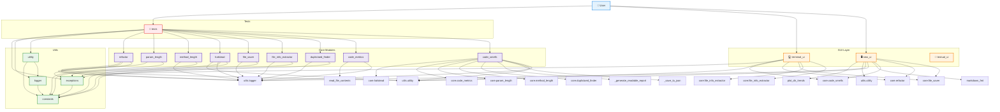

```mermaid

%%{ init: { "theme": "default", "flowchart": { "curve": "basis", "nodeSpacing": 50, "rankSpacing": 60 }, "themeVariables": { "fontSize": "16px" } } }%%

graph TD
%% Layout direction
classDef border fill:#f9f9f9,stroke:#333,stroke-width:1px;
classDef user fill:#e3f2fd,stroke:#1e88e5,stroke-width:2px;
classDef gui fill:#fff3e0,stroke:#f57c00,stroke-width:2px;
classDef core fill:#ede7f6,stroke:#673ab7,stroke-width:2px;
classDef util fill:#e8f5e9,stroke:#43a047,stroke-width:2px;
classDef test fill:#ffebee,stroke:#e53935,stroke-width:2px;

%% User
User["👤 User"]:::user

%% Subgraphs
subgraph GUI Layer
  direction TB
  new_ui["🖥️ new_ui"]:::gui
  terminal_ui["💻 terminal_ui"]:::gui
  textual_ui["🧱 textual_ui"]:::gui
end

subgraph Core Modules
  direction TB
  code_metrics:::core
  code_smells:::core
  duplictaed_finder:::core
  file_info_extractor:::core
  file_saver:::core
  halstead:::core
  method_length:::core
  param_length:::core
  refactor:::core
end

subgraph Utils
  direction TB
  utility:::util
  logger:::util
  exceptions:::util
  constants:::util
end

subgraph Tests
  direction TB
  tests["🧪 tests"]:::test
end

%% User interaction
User --> new_ui
User --> terminal_ui
User --> tests

%% GUI logic
new_ui --> save_refactored_file[core.file_saver]
new_ui --> refactor_duplicates[core.refactor]
new_ui --> find_code_smells[core.code_smells]
new_ui --> markdown_fmt
new_ui --> _read_file_contents[utils.utility]
new_ui --> setup_logger[utils.logger]
new_ui --> clean_dirs[utils.utility]
new_ui --> plot_dir_trends

terminal_ui --> extract_file_info[core.file_info_extractor]
terminal_ui --> save_to_json[core.file_info_extractor]
terminal_ui --> save_refactored_file
terminal_ui --> refactor_duplicates
terminal_ui --> find_code_smells
terminal_ui --> _read_file_contents
terminal_ui --> exceptions

%% Core dependencies
code_smells --> setup_logger
code_smells --> _read_file_contents
code_smells --> _save_to_json
code_smells --> _generate_readable_report
code_smells --> _find_duplictaed_code[core.duplictaed_finder]
code_smells --> _find_long_method[core.method_length]
code_smells --> _find_long_parameter_list[core.param_length]
code_smells --> fetch_code_metrics[core.code_metrics]
code_smells --> fetch_halstead_metrics[core.halstead]

code_metrics --> setup_logger
code_metrics --> read_file_contents

duplictaed_finder --> constants
duplictaed_finder --> setup_logger

file_info_extractor --> constants
file_info_extractor --> setup_logger

file_saver --> exceptions
file_saver --> setup_logger

halstead --> constants
halstead --> exceptions
halstead --> setup_logger
halstead --> _read_file_contents

method_length --> constants
method_length --> setup_logger

param_length --> constants
param_length --> setup_logger

refactor --> setup_logger
refactor --> exceptions
refactor --> _read_file_contents

%% Utils relationships
utility --> logger
utility --> constants

logger --> constants
exceptions --> constants

%% Tests
tests --> code_smells
tests --> code_metrics
tests --> duplictaed_finder
tests --> file_info_extractor
tests --> file_saver
tests --> halstead
tests --> method_length
tests --> param_length
tests --> refactor
tests --> utility
tests --> logger
tests --> exceptions
```
